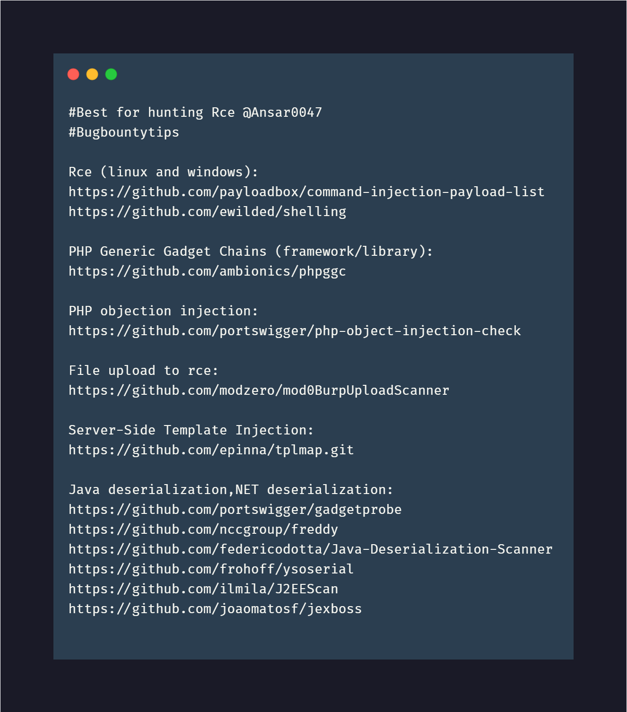
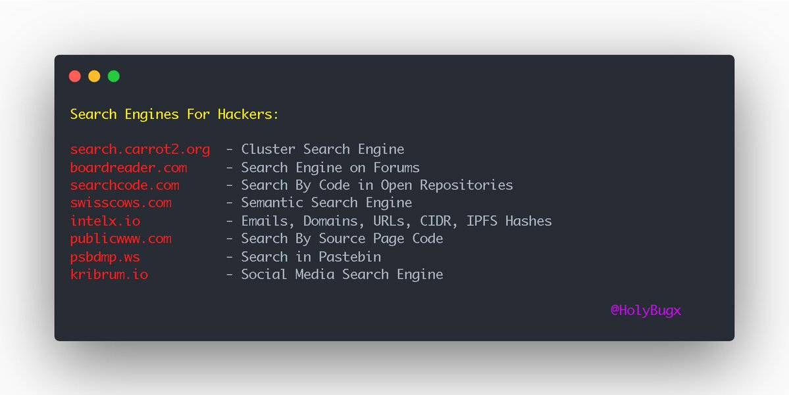
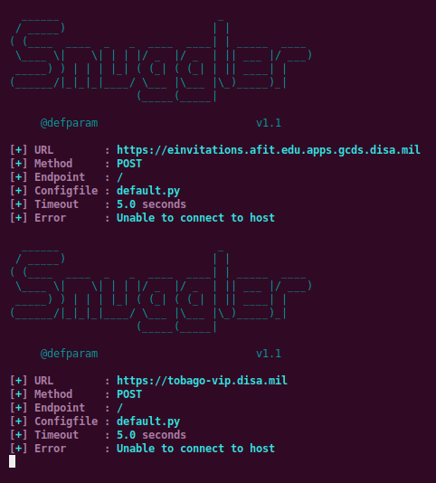

 In these days lot of bug bounty hunters were sharing their critical bug hunting techniques & tips sharing via twitter and other platforms. I would like share whole tips / tricks at one place. Would  like to keep  update my post.

### Bug Bounty Tips  & Tricks

##### Title: Admin Panel Access - Developers Browser Saved Password list
**Description**: Got Admin Panel credentials leaked in a developers browser-saved password list on Github. (Bad idea)  
**Trick/Tip**:
```bash
"http://site.com" extension:csv  - (Github Dork)
```  
**Reference**: [Twitter Post](https://twitter.com/IfrahIman_/status/1342833548059955202)  
------------------------------------------------------------------------------------------------------------------------------------------------------------------------------------------------------------------------------
##### Title: RCE Cheatsheet - Ansar
**Description**: Hunting RCE bugs reference tools/links.  
**Trick/Tip**:
<figure>

</figure>  
**Reference**: [Twitter Post](https://twitter.com/Ansar0047/status/1341515400270376962)   
------------------------------------------------------------------------------------------------------------------------------------------------------------------------------------------------------------------------------
##### Title: Word Press - Vulnerable Plugins
**Description**: Find out the vulnerable plugins and relevant bugs.  
**Trick/Tip**:
```bash
- http://site.com was using wordpress
- Found via wappalyzer; found version
- Scan all plugin
- wpscan --url http://site.com
- Search for cve for specific version
- Found jsmol plugin vulnerable to ssf
```  
**Reference**: [Twitter Post](https://twitter.com/naman_1910/status/1343419459357196289)  
------------------------------------------------------------------------------------------------------------------------------------------------------------------------------------------------------------------------------
##### Title: CSRF+IDOR in 2 minutes
**Description**: Identify the CSRF+IDOR bug using below technique.   
**Trick/Tip**:
```bash
- Update profile name and pic
- Capture request
- Remove csrf header //bypass
- Change id to victime  id
- Luckily id was leaking in public profile
- Send the request name,address,profile pic changed
```  
**Reference**: [Twitter Post](https://twitter.com/naman_1910/status/1343146066795847684)  
------------------------------------------------------------------------------------------------------------------------------------------------------------------------------------------------------------------------------
##### Title: Broken Access Control to Mass Account Takeover
**Description**: Mass account take over bug   
**Trick/Tip**:
<figure>

</figure>  
**Reference**: [Twitter Post](https://twitter.com/krizzsk/status/1340998220902625280)  
------------------------------------------------------------------------------------------------------------------------------------------------------------------------------------------------------------------------------
##### Title: Useful Search engines for Bug Hunters
**Description**: Search engines for hackers/researchers.  
**Trick/Tip**:
<figure>

</figure>  
**Reference**: [Twitter Post](https://twitter.com/secnhack/status/1342847754687549441)  
------------------------------------------------------------------------------------------------------------------------------------------------------------------------------------------------------------------------------
##### Title: HTTP Request Smuggling Bug
**Description**: HTTP request smuggling is a technique for interfering with the way a web site processes sequences of HTTP requests that are received from one or more users.  
**Trick/Tip**:
```bash
httpx -l subfinder -silent | rush -j 300 'python3 http://smuggler.py -u {} --quiet' FireFirecracker
```  
<figure>

</figure>  
**Reference**:   
[Twitter Post](https://twitter.com/secnhack/status/1343135065824403457)  
[Github](https://github.com/defparam/smuggler)  
[Article](https://portswigger.net/web-security/request-smuggling)  
------------------------------------------------------------------------------------------------------------------------------------------------------------------------------------------------------------------------------
##### Title: Github Dorks : Company OSINT/Bugs/Disclosure
**Description**: Company based Github Dorks  
**Trick/Tip**:   
```bash
"company name" db_password
"company name" "Authorization: Bearer"
"company name" filename:vim_settings.xml
"company name" language:shell
"company name" language:python
"company name" fb_secret
```  
**Reference**: [Twitter Post](https://twitter.com/payloadartist/status/1341811781728133122)  
------------------------------------------------------------------------------------------------------------------------------------------------------------------------------------------------------------------------------
##### Title:  Bypassing File Upload Filters
**Description**: Bypass the file upload filters using below techniques  
**Trick/Tip**:   
<figure>

</figure>   
**Reference**: [Twitter Post](https://twitter.com/infosecsanyam/status/1342743262352781313)
------------------------------------------------------------------------------------------------------------------------------------------------------------------------------------------------------------------------------
##### Title:  Tools List: Hunt XSS Vulnerabilities/Bugs  
**Description**: Hunting XSS vulnerable bugs using below tools.   
**Trick/Tip**:   
```bash
XSSer
W3af
Probely
Power fuzzer
Burp Suite
Netsparker
ZAProxy
WebScarab
XSStrike
XSScrapy
wfuzz
ImmuniWeb On-demand
nmap
JMeter
wapiti
ZAP-CLI
Arachni
XSS Hunter
Firebug
xsssniper
Skipfish
KNOXSS
Acunetix
Psalm
```  
**Reference**: [Twitter Post](https://twitter.com/_Bugbountytips_/status/1343624782814867457)  
------------------------------------------------------------------------------------------------------------------------------------------------------------------------------------------------------------------------------
##### Title:  Bypassing File Upload Filters
**Description**: Bypass the file upload filters using below techniques  
**Trick/Tip**:   
<figure>

</figure>   
**Reference**: [Twitter Post](https://twitter.com/infosecsanyam/status/1342743262352781313)
------------------------------------------------------------------------------------------------------------------------------------------------------------------------------------------------------------------------------
